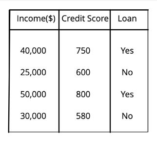
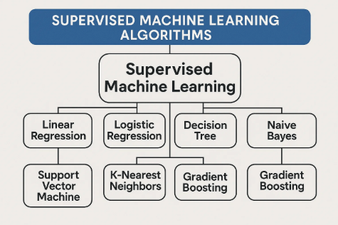

# 🤷‍♂️ What is Machine Learning

---

Machine Learning is a **method of teaching computers** to learn from **data**—similar to how humans learn from experience.
Instead of programming every step, we provide machines with lots of data and let them discover patterns on their own.

**✨ Real-Life Examples of ML:**

- **YouTube Recommendations:** Learns from your watch history
- **Spam Detection in Gmail:** Learns patterns in spam emails
- **Voice Assistants (Siri, Alexa):** Learn how you speak
- **Self-driving Cars:** Learn to identify stop signs, pedestrians, and roads
- **Face Unlock on Phones:** Learns to recognize your face

---

# 🤖 Traditional Programming vs Machine Learning

## 💻 Traditional Programming

- **Approach:** You provide the **rules (logic)** and **data (input)** → The computer gives you the **result (output)**
- **Process:**
  - Programmer writes explicit logic
  - Computer follows fixed instructions
- **Example:**
  - If age < 18 → label as "minor"
  - If age ≥ 18 → label as "adult"

---

## 🧠 Machine Learning

- **Approach:** You provide the **data (input)** and the **results (output/labels)** → The computer learns and creates the **rules (model)**
- **Process:**
  - No need for manual logic
  - Learns patterns and relationships from data automatically
- **Example:**
  - Give ages and corresponding "minor"/"adult" labels
  - ML algorithm figures out the rule by itself

---

## 🌟 In Short

- **Traditional Programming:** Rules + Data → Result
- **Machine Learning:** Data + Result → Rules (Model)

---

# 🤖 AI vs ML vs DL — Simple Notes, Examples & Venn Diagram

## 🧠 AI — Artificial Intelligence

- **Definition:** The broad field of making machines smart (mimic human intelligence and reasoning).
- **Key Point:** **AI = Any system that mimics human intelligence**
- **Scope:** The "big umbrella"—includes rule-based systems, logic, planning, as well as ML and DL.

**Examples:**

- Playing chess like a human (AI chess bots)
- Talking to Alexa or Siri (voice assistants)
- Self-driving cars (autonomous navigation)
- Google Translate (language conversion)

---

## 🧩 ML — Machine Learning

- **Definition:** A subset of AI where machines **learn from data** and improve themselves over time (without being explicitly programmed for every task).
- **Key Point:** **ML = AI that learns from data**
- **Scope:** A branch inside AI. Focuses on algorithms that find patterns in data.

**Examples:**

- YouTube recommending videos based on your watch history
- Netflix predicting your next favorite show
- Gmail filtering spam emails
- Credit card fraud detection

---

## 🧬 DL — Deep Learning

- **Definition:** A subset of Machine Learning that uses **neural networks** (inspired by the human brain) to handle very complex patterns and big data (images, speech, etc.).
- **Key Point:** **DL = ML using neural networks for big, complex data**
- **Scope:** A specialized area within ML, excels at tasks like image, sound, and language understanding.

**Examples:**

- Face recognition unlock on phones
- ChatGPT and other chatbots 🤖
- Self-driving car vision (image/video analysis)
- Real-time language translation (speech-to-speech)

---

## 🎯 Summary Table

|          | AI                         | ML                      | DL                           |
| -------- | -------------------------- | ----------------------- | ---------------------------- |
| Is a...  | Field                      | Subset of AI            | Subset of ML                 |
| Learns?  | Not always                 | Yes, from data          | Yes, via neural networks     |
| Examples | Chess, Alexa, self-driving | YouTube, Netflix, Gmail | Face ID, ChatGPT, car vision |
| Key Idea | Mimics human intelligence  | Learns from data        | Learns via neural networks   |

---

## 🎨 Set Venn Diagram

Below is a text-art representation. For beautiful diagrams, you can use tools like [draw.io](https://draw.io), [Canva](https://canva.com), or markdown with embedded images.

```
        +-------------------------------------+
        |      Artificial Intelligence        |
        |  +-------------------------------+  |
        |  |      Machine Learning         |  |
        |  |   +-----------------------+   |  |
        |  |   |   Deep Learning       |   |  |
        |  |   +-----------------------+   |  |
        |  |                               |  |
        |  +-------------------------------+  |
        |                                     |
        +-------------------------------------+
```

- **Everything inside the largest rectangle** is AI.
- **ML** is a subset of AI (focuses on algorithms).
- **DL** is a subset of ML (complex techniques and algorithms).

---

## 🌟 In Short

- **AI:** The big picture—making machines smart.
- **ML:** The brain that learns from data (inside AI).
- **Deep Learning:** The super-powered brain (inside ML) for really tough, big-data problems!

---

# 🤖 Types of Machine Learning — Notes with Examples & Visuals

## 1️⃣ Supervised Learning

- **What is it?** Like a student learning from a teacher. The machine gets both input data **and** the correct answers (labels), and learns to predict outcomes.
- **How it works:**

  - Both input and output variables are provided during training.
  - The model learns the relationship and can predict the output for new inputs.
- **Example Table:**

  

  *Here, "Income" and "Credit Score" are inputs; "Loan" (Yes/No) is the output (label).*
- **Popular Algorithms:**

  
- **Real-life Examples:**

  - Email spam detection (input: email text, output: spam/not spam)
  - Loan approval (input: applicant info, output: approve/deny)
  - Image recognition (input: image, output: label)

---

## 2️⃣ Unsupervised Learning

- **What is it?** The machine gets input data **only**—there are no correct answers provided. It tries to find patterns, group similar things, or detect outliers.
- **How it works:**
  - The algorithm finds structure in data (like clustering).
  - No labels or answers are given.
- **What is Clustering?** Clustering is about grouping similar data points together **without knowing group labels in advance**.
  - Imagine a scatterplot of dots: clustering draws circles around groups of dots that are close together.
  - For example, grouping customers based on their shopping habits, when you don't know categories ahead of time.
- **Clustering Algorithms:**
  - K-Means Clustering
  - Hierarchical Clustering
  - DBSCAN
- **Clustering Real-life Examples:**
  - Grouping customers by buying habits
  - Organizing news articles into topics
  - Detecting fraud (spotting unusual patterns)
  - Photo apps grouping faces automatically
- **Other Unsupervised Examples:**
  - Dimensionality reduction (PCA)
  - Anomaly detection

---

## 3️⃣ Reinforcement Learning

- **What is it?** Like training a dog: reward good behavior, discourage bad. The agent learns by trial and error, receiving feedback (rewards or penalties).
- **How it works:**
  - Takes actions in an environment.
  - Gets feedback (reward/penalty) and learns the best strategy over time.
- **Real-life Examples:**
  - Game playing (chess, Go, video games)
  - Robotics (robot learning to walk)
  - Self-driving cars (learning to navigate)
  - Recommender systems (learning best suggestions)

---

## 🌟 Summary Table

| Type                   | Data Used | Goal                 | Example                                |
| ---------------------- | --------- | -------------------- | -------------------------------------- |
| Supervised Learning    | Labeled   | Predict output       | Email spam detection, loan approval    |
| Unsupervised Learning  | Unlabeled | Find patterns/groups | Customer clustering, anomaly detection |
| Reinforcement Learning | Feedback  | Maximize reward      | Chess, robotics, self-driving cars     |

---

**Key Points:**

- **Supervised Learning:** Learn from examples with answers (labels).
- **Unsupervised Learning:** Find structure in data without answers.
  - **Clustering** is a main technique here: grouping data into clusters when you don’t know the group labels in advance!
- **Reinforcement Learning:** Learn by trial and error, getting rewards or penalties.

---

# 🐍 Python for Machine Learning

## 📝 Comments in Python

- **Single Line:**`# This is a single line comment.`
- **Multiline:**
  Use triple quotes.
  ```python
  """
  This is a
  multiline comment.
  """
  ```

---

## 🧮 Variables

- **Definition:** Variables store data for later use—like a bottle stores water.
- **Example:**
  ```python
  name = "My name is Rashed"
  age = 22
  ```

### ✅ Variable Naming Rules

| Rule                                | Example | Not Allowed  |
| ----------------------------------- | ------- | ------------ |
| Can't start with digit/special char | my_name | 1name, $name |
| No spaces                           | myname  | my name      |
| Use letters, digits, _              | age22   | n/a          |

### ✨ Naming Styles

- **camelCase:** `myName`
- **PascalCase:** `MyName`
- **snake_case:** `my_name`

---

## 📦 Data Types

| Type     | Example(s)                       |
| -------- | -------------------------------- |
| Integer  | `1, 2, -1, -10000, -1e308`     |
| Complex  | `1+2j`                         |
| Float    | `1.1, 1.02, -1.99, -2.23e-308` |
| String   | `"raju", 'r', "Rashed Jaman"`  |
| Boolean  | `True, False`                  |
| NoneType | `None`                         |

**Type Checker:**

```python
print(type(age))  # <class 'int'>
```

---

## 🖨️ Print Styles

- **Default:**
  ```python
  print("Hello, World!")
  ```
- **Concatenation:**
  ```python
  print("Age is " + str(age))
  ```
- **f-string (recommended):**
  ```python
  print(f"I am {age} years old")
  ```
- **.format():**
  ```python
  print("I am {} years old".format(age))
  ```

---

## 🧵 Indexing & Slicing Strings

- **Access character:**`print(name[1])  # 'y'`
- **Slice substring:**
  `print(name[0:2])  # 'My'`
  `print(name[:2])   # 'My'`
  `print(name[2:])   # ' name is Rashed'`

### 🪓 Slicing with Steps

```python
alphabets = "abcdefghijklmnopqrstuvwxyz"
print(alphabets[0:27:1])  # 'abcdefghijklmnopqrstuvwxyz'
print(alphabets[0:27:2])  # 'acegikmoqsuwy'
print(alphabets[0:27:3])  # 'adgjmpsvy'
print(alphabets[0:27:4])  # 'aeimquy'
```

### 💡 Real-life Slicing Examples

- **Extract domain from email:**
  ```python
  email = "user@example.com"
  domain = email[email.index("@")+1:]
  print(domain)  # 'example.com'
  ```
- **Reverse a string:**
  ```python
  s = "python"
  print(s[::-1])  # 'nohtyp'
  ```
- **Get file extension:**
  ```python
  filename = "document.pdf"
  ext = filename[-3:]
  print(ext)  # 'pdf'
  ```
- **First name from full name:**
  ```python
  full_name = "Rashed Jaman"
  first_name = full_name.split()[0]
  print(first_name)  # 'Rashed'
  ```

---

## 🔄 Type Conversion

### Implicit (Automatic)

Python converts types automatically if possible.

```python
a = 5
b = 2.0
result = a + b  # result is 7.0 (float)
```

### Explicit (Manual)

You convert types directly.

```python
a = "123"
b = int(a)   # 123 (int)
c = float(a) # 123.0 (float)
d = str(456) # "456" (str)
```

---

## ❌ Falsy Values in Python

Falsy values evaluate as `False` in a boolean context:

- `None`
- `False`
- `0`, `0.0`, `0j`
- `''` (empty string)
- `[]` (empty list)
- `{}` (empty dict)
- `()` (empty tuple)
- `set()` (empty set)

Example:

```python
if not []:
    print("Empty list is falsy")
```

---

## ⌨️ The `input()` Function

- **Default (string):**
  ```python
  name = input("Enter your name: ")
  ```
- **Integer input:**
  ```python
  age = int(input("Enter your age: "))
  ```
- **Float input:**
  ```python
  height = float(input("Enter your height in meters: "))
  ```
- **Multiple inputs:**
  ```python
  x, y = input("Enter two numbers: ").split()
  x = int(x)
  y = int(y)
  ```

---

## ➕ Operators

### Arithmetic

| Operator | Meaning        | Example    |
| -------- | -------------- | ---------- |
| `+`    | Addition       | `a + b`  |
| `-`    | Subtraction    | `a - b`  |
| `*`    | Multiplication | `a * b`  |
| `/`    | Division       | `a / b`  |
| `//`   | Floor Div      | `a // b` |
| `%`    | Modulus        | `a % b`  |
| `**`   | Exponent       | `a ** b` |

### Assignment

| Operator | Example   |
| -------- | --------- |
| `=`    | `a = 5` |

### Compound Assignment

| Operator | Example    | Same as       |
| -------- | ---------- | ------------- |
| `+=`   | `a += 2` | `a = a + 2` |
| `-=`   | `a -= 2` | `a = a - 2` |
| ...      | ...        | ...           |

### Comparison

| Operator | Meaning               |
| -------- | --------------------- |
| `==`   | Equal to              |
| `!=`   | Not equal to          |
| `>`    | Greater than          |
| `<`    | Less than             |
| `>=`   | Greater than or equal |
| `<=`   | Less than or equal    |

### Logical

| Operator | Example     |
| -------- | ----------- |
| `and`  | `a and b` |
| `or`   | `a or b`  |
| `not`  | `not a`   |

---

## 🔀 Conditional Statements

```python
if condition:
    # code
elif another_condition:
    # code
else:
    # code
```

**Example:**

```python
age = 18
if age >= 18:
    print("Adult")
else:
    print("Minor")
```

---

## 🔁 Loops

### 1. While Loop

```python
i = 1
while i <= 5:
    print(i)
    i += 1
```

### 2. For Loop

- **Numbers:**
  ```python
  for i in range(5):  # 0,1,2,3,4
      print(i)
  ```
- **String:**
  ```python
  for char in "hello":
      print(char)
  ```
- **For each (list):**
  ```python
  fruits = ["apple", "banana", "cherry"]
  for fruit in fruits:
      print(fruit)
  ```

---

## 🛠️ Functions

### Without Return Value

```python
def greet():
    print("Hello!")
greet()
```

### With Return Value

```python
def add(a, b):
    return a + b
result = add(2, 3)
print(result)
```

---

### Argument vs Parameter

- **Parameter:** Variable in function definition (`def add(a, b):`)
- **Argument:** Value passed in function call (`add(2, 3)`)

---

### Types of Arguments

1. **Positional:** Matched by order.

   ```python
   def greet(name, age):
       print(f"Hello {name}, you are {age} years old.")
   greet("Rashed", 22)
   ```
2. **Keyword:** Matched by name.

   ```python
   greet(age=22, name="Rashed")
   ```
3. **Default:** Has a default value.

   ```python
   def greet(name, age=18):
       print(f"Hello {name}, you are {age} years old.")
   greet("Rashed")  # uses default age
   ```
4. **Variable-length:**

   - `*args` (tuple), `**kwargs` (dict)

   ```python
   def add(*numbers):
       return sum(numbers)
   print(add(1, 2, 3, 4))

   def info(**data):
       print(data)
   info(name="Rashed", age=22)
   ```

---

## 📚 What are Data Structures?

**Data structures** help store, organize, and manipulate data efficiently.
Python has several built-in data structures that make coding simpler and faster.

---

### 🧱 Four Main Built-In Data Structures

| Structure            | Mutable? | Ordered? | Allows Duplicates? | Heterogeneous? | Syntax              | Example                           |
| -------------------- | -------- | -------- | ------------------ | -------------- | ------------------- | --------------------------------- |
| **List**       | ✅ Yes   | ✅ Yes   | ✅ Yes             | ✅ Yes         | `[ ]`             | `[1, "a", 3.5, True]`           |
| **Tuple**      | ❌ No    | ✅ Yes   | ✅ Yes             | ✅ Yes         | `( )`             | `(1, 2, "a")`                   |
| **Dictionary** | ✅ Yes   | ✅*      | ❌ Keys, ✅ Values | ✅ Yes         | `{}`              | `{"a": 1, "b": "cat"}`          |
| **Set**        | ✅ Yes   | ❌ No    | ❌ No              | ✅ Yes         | `{ }` / `set()` | `{1, 2, 3}` or `set([1,2,3])` |

> *Dictionaries preserve insertion order in Python 3.7+.

---

### 🟦 List

#### 🤷‍♂️ What is a List?

A **list** is a mutable, ordered collection that can store values of any type. Lists allow duplicates and let you change, add, or remove elements.

#### 🏷️ Key Features

- **Mutable:** You can modify elements after creation.
- **Ordered:** Keeps the order you put items in.
- **Duplicates:** Allowed.
- **Heterogeneous:** Can store different data types together.

#### ✅ Creating Lists

```python
nums = [1, 2, 3, 4]
names = ["Rashed", "Jaman"]
mixed = [1, "cat", 3.14, True]
empty = []
nested = [[1, 2], [3, 4]]
single_item = [42]
```

#### 🔢 Indexing & Slicing

```python
fruits = ["apple", "banana", "cherry", "date"]
print(fruits[0])     # 'apple'
print(fruits[-1])    # 'date'
print(fruits[1:3])   # ['banana', 'cherry']
print(fruits[::-1])  # ['date', 'cherry', 'banana', 'apple']
print(fruits[::2])   # ['apple', 'cherry']
```

#### 🔄 List Slicing Examples

```python
lst = [10, 20, 30, 40, 50, 60]
first_three = lst[:3]       # [10, 20, 30]
last_two = lst[-2:]         # [50, 60]
skip_one = lst[::2]         # [10, 30, 50]
reverse = lst[::-1]         # [60, 50, 40, 30, 20, 10]
```

#### ♻️ Mutability: List vs String

```python
s = "hello"
# s[0] = "H"   # ❌ Error: string is immutable

lst = [1, 2, 3]
lst[0] = 10    # ✅ List is mutable
print(lst)     # [10, 2, 3]
```

#### 🔁 Traversing a List

```python
for fruit in fruits:
    print(fruit)

for i in range(len(fruits)):
    print(fruits[i])

# List comprehension
upper = [f.upper() for f in fruits]
print(upper)
```

#### 🛠️ Common List Methods (with Examples & Complexity)

| Method           | Description                            | Example           | Result                          | Complexity |
| ---------------- | -------------------------------------- | ----------------- | ------------------------------- | ---------- |
| `.append(x)`   | Add item to end                        | lst.append(5)     | [1, 2, 3, 5]                    | O(1)       |
| `.insert(i,x)` | Insert x at index i                    | lst.insert(1, 10) | [1, 10, 2, 3]                   | O(n)       |
| `.extend(L)`   | Add items from another list            | lst.extend([6,7]) | [1, 2, 3, 6, 7]                 | O(k)       |
| `.remove(x)`   | Remove first occurrence of x           | lst.remove(2)     | [1, 3]                          | O(n)       |
| `.pop([i])`    | Remove & return item (last by default) | lst.pop()         | returns last item, list shrinks | O(1)/O(n)  |
| `.clear()`     | Remove all items                       | lst.clear()       | []                              | O(n)       |
| `.index(x)`    | Find first index of x                  | lst.index(3)      | 2                               | O(n)       |
| `.count(x)`    | Count number of x                      | lst.count(2)      | 1                               | O(n)       |
| `.sort()`      | Sort list in place                     | lst.sort()        | [1, 2, 3]                       | O(n log n) |
| `.reverse()`   | Reverse list in place                  | lst.reverse()     | [3, 2, 1]                       | O(n)       |
| `.copy()`      | Get a shallow copy                     | new = lst.copy()  | [1, 2, 3]                       | O(n)       |

💡 Method Examples

```python
lst = [3, 1, 4]
lst.append(5)     # [3, 1, 4, 5]
lst.insert(1, 9)  # [3, 9, 1, 4, 5]
lst.remove(9)     # [3, 1, 4, 5]
lst.pop()         # returns 5, lst: [3, 1, 4]
lst.sort()        # [1, 3, 4]
lst.reverse()     # [4, 3, 1]
lst2 = lst.copy() # [4, 3, 1]
lst.clear()       # []
```

#### ⏱️ List Operation Time Complexity (Big-O)

| Operation           | Average Case | Notes                 |
| ------------------- | ------------ | --------------------- |
| Indexing `lst[i]` | O(1)         |                       |
| Append              | O(1)         |                       |
| Insert              | O(n)         | At arbitrary position |
| Delete              | O(n)         | Except at end         |
| Traverse            | O(n)         |                       |
| Sort                | O(n log n)   | TimSort               |
| Search              | O(n)         |                       |

---

### 🟧 Tuple

#### 🤷‍♂️ What is a Tuple?

A **tuple** is like a list but **immutable** (cannot be changed after creation). Ordered, allows duplicates, and can have mixed data types.

#### 🏷️ Key Features

- **Immutable:** Cannot change elements once created.
- **Ordered:** Maintains insertion order.
- **Duplicates:** Allowed.
- **Heterogeneous:** Can store different data types.

#### ✅ Creating Tuples

```python
t1 = (1, 2, 3)
t2 = ("Rashed", 22, 3.14)
t3 = 1, 2, 3           # Parentheses are optional
t4 = (4,)              # Single item tuple needs a comma!
empty = ()
nested = ((1, 2), (3, 4))
```

#### 🔢 Indexing & Slicing

```python
t = (10, 20, 30, 40)
print(t[1])      # 20
print(t[-1])     # 40
print(t[1:3])    # (20, 30)
print(t[::-1])   # (40, 30, 20, 10)
```

#### 🔁 Traversing a Tuple

```python
for item in t:
    print(item)
```

#### 🛠️ Useful Tuple Methods

| Method        | Description            | Example     | Result | Complexity |
| ------------- | ---------------------- | ----------- | ------ | ---------- |
| `.count(x)` | Count occurrences of x | t.count(20) | 1      | O(n)       |
| `.index(x)` | First index of x       | t.index(30) | 2      | O(n)       |

##### 💡 Tuple Examples

```python
# Tuple unpacking
x, y, z = (1, 2, 3)

# Swapping variables
a, b = 5, 10
a, b = b, a

# Returning multiple values from a function
def min_max(nums):
    return min(nums), max(nums)
lo, hi = min_max([3, 7, 1])
```

##### 💡 Tuples are often used for:

- Fixed data (e.g., days of the week)
- As dictionary keys
- Returning multiple values from a function

---

#### 🟨 List vs Tuple: Differences

| Property    | List          | Tuple                      |
| ----------- | ------------- | -------------------------- |
| Syntax      | `[1, 2, 3]` | `(1, 2, 3)`              |
| Mutability  | Mutable       | Immutable                  |
| Methods     | Many          | Few (`count`, `index`) |
| Performance | Slower        | Faster                     |
| Use case    | General data  | Fixed data, keys           |
| Nesting     | Yes           | Yes                        |

```python
# List is mutable
lst = [1, 2, 3]
lst[0] = 99         # works

# Tuple is immutable
tup = (1, 2, 3)
# tup[0] = 99       # ❌ Error
```

---

## 🟩 Dictionary

### What is a Dictionary?

A **dictionary** is a mutable, unordered (insertion ordered as of 3.7+) collection of key-value pairs.
Keys must be unique and immutable; values can be any type.

#### 🏷️ Key Features

- **Mutable:** Can add, change, or remove items.
- **Keys:** Must be unique and immutable (e.g., strings, numbers, tuples).
- **Values:** Can be any type, including lists or dictionaries.
- **Ordered:** Insertion order preserved (Python 3.7+).

### ✅ Creating Dictionaries

```python
person = {"name": "Rashed", "age": 22, "is_student": True}
empty = {}
student = dict(id=1, name="Jaman")
nested = {"scores": {"math": 90, "eng": 85}}
mixed_keys = {1: "one", (2, 3): "tuple key"}
```

### 🔑 Access & Modify

```python
print(person["name"])       # "Rashed"
person["age"] = 23          # Update
person["city"] = "Dhaka"    # Add new key
del person["is_student"]    # Remove key
```

### 🔁 Traversing a Dictionary

```python
for key in person:
    print(key, person[key])

for key, value in person.items():
    print(f"{key}: {value}")

for value in person.values():
    print(value)

for key in person.keys():
    print(key)
```

### 🛠️ Common Dictionary Methods

| Method               | Description                  | Example                               | Result             | Complexity |
| -------------------- | ---------------------------- | ------------------------------------- | ------------------ | ---------- |
| `.get(key, d)`     | Get value, or default        | person.get("age", 0)                  | 22                 | O(1)       |
| `.keys()`          | All keys                     | person.keys()                         | dict_keys([...])   | O(1)       |
| `.values()`        | All values                   | person.values()                       | dict_values([...]) | O(1)       |
| `.items()`         | All key-value pairs          | person.items()                        | dict_items([...])  | O(1)       |
| `.update(d2)`      | Merge another dictionary     | person.update({"age": 24})            | -                  | O(len(d2)) |
| `.pop(key)`        | Remove & return value by key | person.pop("city")                    | "Dhaka"            | O(1)       |
| `.popitem()`       | Remove & return last pair    | person.popitem()                      | (key, value)       | O(1)       |
| `.clear()`         | Remove all items             | person.clear()                        | {}                 | O(n)       |
| `.setdefault(k,v)` | Get key, set if not exists   | person.setdefault("hobby", "reading") | "reading"          | O(1)       |
| `.copy()`          | Shallow copy                 | p2 = person.copy()                    | {...}              | O(n)       |
| `fromkeys()`       | Create dict from keys        | dict.fromkeys(['a','b'], 0)           | {'a': 0, 'b': 0}   | O(n)       |

#### 💡 Dictionary Examples

```python
person = {"name": "Rashed", "age": 22}
person["country"] = "Bangladesh"
print(person.get("city", "Unknown"))
for k, v in person.items():
    print(k, v)

# Nested dictionary
students = {
    "Alice": {"math": 90, "eng": 85},
    "Bob":   {"math": 75, "eng": 80}
}
print(students["Alice"]["math"])  # 90
```

### ⏱️ Dictionary Time Complexity

| Operation       | Average Case | Notes |
| --------------- | ------------ | ----- |
| Access by key   | O(1)         |       |
| Insert/Update   | O(1)         |       |
| Delete by key   | O(1)         |       |
| Traverse all    | O(n)         |       |
| Search by value | O(n)         |       |

---

## 🟪 Set

### What is a Set?

A **set** is an unordered collection of unique, immutable items.
Useful for membership tests, removing duplicates, and set operations.

#### 🏷️ Key Features

- **Mutable:** Can add/remove items.
- **Unordered:** No indexing or slicing.
- **Unique:** No duplicates.
- **Heterogeneous:** Mixed immutable types allowed.

### ✅ Creating Sets

```python
s = {1, 2, 3}
empty = set()         # NOT {} (that's a dict)
mixed = {1, 2, "a", (3, 4)}
dup = {1, 2, 2, 3}    # {1, 2, 3}
from_list = set([1, 2, 2, 3])  # {1, 2, 3}
```

### ❌ Set Indexing & Slicing

```python
# s[0]  # ❌ Error: sets are unordered, no indexing!
# s[1:3] # ❌ Error
```

### 🔁 Traversing a Set

```python
for item in s:
    print(item)
```

### 🛠️ Common Set Methods

| Method               | Description                       | Example                                | Result      | Complexity            |
| -------------------- | --------------------------------- | -------------------------------------- | ----------- | --------------------- |
| `.add(x)`          | Add element                       | s.add(4)                               | {1,2,3,4}   | O(1)                  |
| `.remove(x)`       | Remove element (error if missing) | s.remove(2)                            | {1,3}       | O(1)                  |
| `.discard(x)`      | Remove if present (no error)      | s.discard(5)                           | -           | O(1)                  |
| `.pop()`           | Remove & return arbitrary element | s.pop()                                | -           | O(1)                  |
| `.clear()`         | Remove all items                  | s.clear()                              | set()       | O(n)                  |
| `.copy()`          | Shallow copy                      | s2 = s.copy()                          | -           | O(n)                  |
| `.update(iter)`    | Add elements from iterable        | s.update([4, 5])                       | {1,2,3,4,5} | O(k)                  |
| `.union(t)`        | Set union                         | s.union({4, 5})                        | {1,2,3,4,5} | O(len(s)+len(t))      |
| `.intersection(t)` | Set intersection                  | s & {2,3,4} or s.intersection({2,3,4}) | {2,3}       | O(min(len(s),len(t))) |
| `.difference(t)`   | Set difference                    | s - {2,3}                              | {1}         | O(len(s))             |
| `.issubset(t)`     | Subset test                       | s.issubset({1,2,3,4})                  | True/False  | O(len(s))             |
| `.issuperset(t)`   | Superset test                     | s.issuperset({1,2})                    | True/False  | O(len(t))             |

#### 💡 Set Examples

```python
a = {1, 2, 3}
b = {3, 4, 5}
print(a | b)        # Union: {1,2,3,4,5}
print(a & b)        # Intersection: {3}
print(a - b)        # Difference: {1,2}
print(a ^ b)        # Symmetric difference: {1,2,4,5}

# Remove duplicates from list
lst = [1, 2, 2, 3, 4, 4]
unique = set(lst)   # {1, 2, 3, 4}
```

### ⏱️ Set Time Complexity

| Operation       | Average Case | Notes      |
| --------------- | ------------ | ---------- |
| Add/Remove      | O(1)         |            |
| Membership Test | O(1)         | `x in s` |
| Traverse all    | O(n)         |            |
| Set Operations  | O(len(s))    |            |

---

## 🟦🟧🟩🟪 Quick Summary Table

| Feature    | List         | Tuple          | Dictionary   | Set          |
| ---------- | ------------ | -------------- | ------------ | ------------ |
| Syntax     | `[1,2,3]`  | `(1,2,3)`    | `{'a': 1}` | `{1,2,3}`  |
| Ordered    | Yes          | Yes            | Yes*         | No           |
| Mutable    | Yes          | No             | Yes          | Yes          |
| Indexing   | Yes          | Yes            | By key       | No           |
| Duplicates | Yes          | Yes            | Keys: No     | No           |
| Methods    | Many         | Few            | Many         | Many         |
| Use Case   | General data | Fixed/constant | Mappings     | Unique items |

---

## 🏗️ Custom Data Structures (Concept)

Python allows you to build your own data structures for advanced needs:

- Stack
- Queue
- Linked List
- Graph
- (And more...)

These are the backbone of Data Structures & Algorithms (DSA).
But this note is focused on Python's **built-in** data structures only.

---

## 🏁 Quick Practice Snippets

**Lists:**

```python
lst = [1, 2, 3]
lst.append(4)
lst.insert(0, 0)
lst.extend([5, 6])
lst.remove(2)
item = lst.pop()
idx = lst.index(3)
cnt = lst.count(1)
lst.sort()
lst.reverse()
lst2 = lst.copy()
lst.clear()
print(lst)
```

**Tuples:**

```python
t = (1, 2, 3)
print(t[0])
print(t.count(2))
print(t.index(3))
# Unpacking
a, b, c = t
# Nested
nt = ((1, 2), (3, 4))
```

**Dictionaries:**

```python
person = {"name": "Rashed", "age": 22}
person["country"] = "Bangladesh"
print(person.get("city", "Unknown"))
for k, v in person.items():
    print(k, v)
# Nested
students = {
    "Alice": {"math": 90, "eng": 85},
    "Bob":   {"math": 75, "eng": 80}
}
print(students["Alice"]["math"])
```

**Sets:**

```python
a = {1, 2, 3}
b = {3, 4, 5}
print(a | b)    # Union
print(a & b)    # Intersection
print(a - b)    # Difference
print(a ^ b)    # Symmetric difference
# Remove duplicates
lst = [1, 2, 2, 3, 4, 4]
print(set(lst))
```

---

> **Tip:** Practice every example and method in your Python shell or script to master them!
