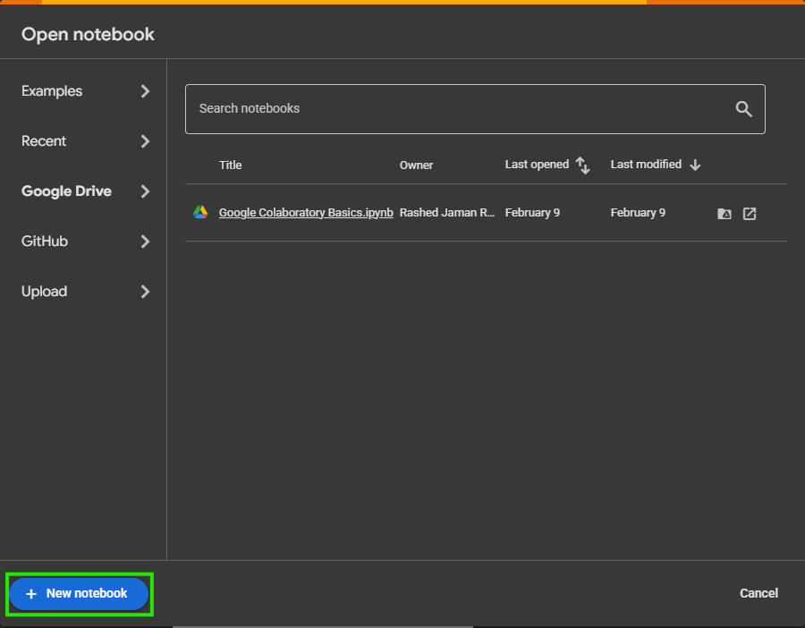

# 🐍 Python for Machine Learning

## 📝 Comments in Python

- **Single Line:**`# This is a single line comment.`
- **Multiline:**
  Use triple quotes.
  ```python
  """
  This is a
  multiline comment.
  """
  ```

---

## 🧮 Variables

- **Definition:** Variables store data for later use—like a bottle stores water.
- **Example:**
  ```python
  name = "My name is Rashed"
  age = 22
  ```

### ✅ Variable Naming Rules

| Rule                                | Example | Not Allowed  |
| ----------------------------------- | ------- | ------------ |
| Can't start with digit/special char | my_name | 1name, $name |
| No spaces                           | myname  | my name      |
| Use letters, digits, _              | age22   | n/a          |

### ✨ Naming Styles

- **camelCase:** `myName`
- **PascalCase:** `MyName`
- **snake_case:** `my_name`

---

## 📦 Data Types

| Type     | Example(s)                       |
| -------- | -------------------------------- |
| Integer  | `1, 2, -1, -10000, -1e308`     |
| Complex  | `1+2j`                         |
| Float    | `1.1, 1.02, -1.99, -2.23e-308` |
| String   | `"raju", 'r', "Rashed Jaman"`  |
| Boolean  | `True, False`                  |
| NoneType | `None`                         |

**Type Checker:**

```python
print(type(age))  # <class 'int'>
```

---

## 🖨️ Print Styles

- **Default:**
  ```python
  print("Hello, World!")
  ```
- **Concatenation:**
  ```python
  print("Age is " + str(age))
  ```
- **f-string (recommended):**
  ```python
  print(f"I am {age} years old")
  ```
- **.format():**
  ```python
  print("I am {} years old".format(age))
  ```

---

## 🧵 Indexing & Slicing Strings

- **Access character:**`print(name[1])  # 'y'`
- **Slice substring:**
  `print(name[0:2])  # 'My'`
  `print(name[:2])   # 'My'`
  `print(name[2:])   # ' name is Rashed'`

### 🪓 Slicing with Steps

```python
alphabets = "abcdefghijklmnopqrstuvwxyz"
print(alphabets[0:27:1])  # 'abcdefghijklmnopqrstuvwxyz'
print(alphabets[0:27:2])  # 'acegikmoqsuwy'
print(alphabets[0:27:3])  # 'adgjmpsvy'
print(alphabets[0:27:4])  # 'aeimquy'
```

### 💡 Real-life Slicing Examples

- **Extract domain from email:**
  ```python
  email = "user@example.com"
  domain = email[email.index("@")+1:]
  print(domain)  # 'example.com'
  ```
- **Reverse a string:**
  ```python
  s = "python"
  print(s[::-1])  # 'nohtyp'
  ```
- **Get file extension:**
  ```python
  filename = "document.pdf"
  ext = filename[-3:]
  print(ext)  # 'pdf'
  ```
- **First name from full name:**
  ```python
  full_name = "Rashed Jaman"
  first_name = full_name.split()[0]
  print(first_name)  # 'Rashed'
  ```

---

## 🔄 Type Conversion

### Implicit (Automatic)

Python converts types automatically if possible.

```python
a = 5
b = 2.0
result = a + b  # result is 7.0 (float)
```

### Explicit (Manual)

You convert types directly.

```python
a = "123"
b = int(a)   # 123 (int)
c = float(a) # 123.0 (float)
d = str(456) # "456" (str)
```

---

## ❌ Falsy Values in Python

Falsy values evaluate as `False` in a boolean context:

- `None`
- `False`
- `0`, `0.0`, `0j`
- `''` (empty string)
- `[]` (empty list)
- `{}` (empty dict)
- `()` (empty tuple)
- `set()` (empty set)

Example:

```python
if not []:
    print("Empty list is falsy")
```

---

## ⌨️ The `input()` Function

- **Default (string):**
  ```python
  name = input("Enter your name: ")
  ```
- **Integer input:**
  ```python
  age = int(input("Enter your age: "))
  ```
- **Float input:**
  ```python
  height = float(input("Enter your height in meters: "))
  ```
- **Multiple inputs:**
  ```python
  x, y = input("Enter two numbers: ").split()
  x = int(x)
  y = int(y)
  ```

---

## ➕ Operators

### Arithmetic

| Operator | Meaning        | Example    |
| -------- | -------------- | ---------- |
| `+`    | Addition       | `a + b`  |
| `-`    | Subtraction    | `a - b`  |
| `*`    | Multiplication | `a * b`  |
| `/`    | Division       | `a / b`  |
| `//`   | Floor Div      | `a // b` |
| `%`    | Modulus        | `a % b`  |
| `**`   | Exponent       | `a ** b` |

### Assignment

| Operator | Example   |
| -------- | --------- |
| `=`    | `a = 5` |

### Compound Assignment

| Operator | Example    | Same as       |
| -------- | ---------- | ------------- |
| `+=`   | `a += 2` | `a = a + 2` |
| `-=`   | `a -= 2` | `a = a - 2` |
| ...      | ...        | ...           |

### Comparison

| Operator | Meaning               |
| -------- | --------------------- |
| `==`   | Equal to              |
| `!=`   | Not equal to          |
| `>`    | Greater than          |
| `<`    | Less than             |
| `>=`   | Greater than or equal |
| `<=`   | Less than or equal    |

### Logical

| Operator | Example     |
| -------- | ----------- |
| `and`  | `a and b` |
| `or`   | `a or b`  |
| `not`  | `not a`   |

---

## 🔀 Conditional Statements

```python
if condition:
    # code
elif another_condition:
    # code
else:
    # code
```

**Example:**

```python
age = 18
if age >= 18:
    print("Adult")
else:
    print("Minor")
```

---

## 🔁 Loops

### 1. While Loop

```python
i = 1
while i <= 5:
    print(i)
    i += 1
```

### 2. For Loop

- **Numbers:**
  ```python
  for i in range(5):  # 0,1,2,3,4
      print(i)
  ```
- **String:**
  ```python
  for char in "hello":
      print(char)
  ```
- **For each (list):**
  ```python
  fruits = ["apple", "banana", "cherry"]
  for fruit in fruits:
      print(fruit)
  ```

---

## 🛠️ Functions

### Without Return Value

```python
def greet():
    print("Hello!")
greet()
```

### With Return Value

```python
def add(a, b):
    return a + b
result = add(2, 3)
print(result)
```

---

### Argument vs Parameter

- **Parameter:** Variable in function definition (`def add(a, b):`)
- **Argument:** Value passed in function call (`add(2, 3)`)

---

### Types of Arguments

1. **Positional:** Matched by order.

   ```python
   def greet(name, age):
       print(f"Hello {name}, you are {age} years old.")
   greet("Rashed", 22)
   ```
2. **Keyword:** Matched by name.

   ```python
   greet(age=22, name="Rashed")
   ```
3. **Default:** Has a default value.

   ```python
   def greet(name, age=18):
       print(f"Hello {name}, you are {age} years old.")
   greet("Rashed")  # uses default age
   ```
4. **Variable-length:**

   - `*args` (tuple), `**kwargs` (dict)

   ```python
   def add(*numbers):
       return sum(numbers)
   print(add(1, 2, 3, 4))

   def info(**data):
       print(data)
   info(name="Rashed", age=22)
   ```

---

## 📚 What are Data Structures?

**Data structures** help store, organize, and manipulate data efficiently.
Python has several built-in data structures that make coding simpler and faster.

---

### 🧱 Four Main Built-In Data Structures

| Structure            | Mutable? | Ordered? | Allows Duplicates? | Heterogeneous? | Syntax              | Example                           |
| -------------------- | -------- | -------- | ------------------ | -------------- | ------------------- | --------------------------------- |
| **List**       | ✅ Yes   | ✅ Yes   | ✅ Yes             | ✅ Yes         | `[ ]`             | `[1, "a", 3.5, True]`           |
| **Tuple**      | ❌ No    | ✅ Yes   | ✅ Yes             | ✅ Yes         | `( )`             | `(1, 2, "a")`                   |
| **Dictionary** | ✅ Yes   | ✅*      | ❌ Keys, ✅ Values | ✅ Yes         | `{}`              | `{"a": 1, "b": "cat"}`          |
| **Set**        | ✅ Yes   | ❌ No    | ❌ No              | ✅ Yes         | `{ }` / `set()` | `{1, 2, 3}` or `set([1,2,3])` |

> *Dictionaries preserve insertion order in Python 3.7+.

---

### 🟦 List

#### 🤷‍♂️ What is a List?

A **list** is a mutable, ordered collection that can store values of any type. Lists allow duplicates and let you change, add, or remove elements.

#### 🏷️ Key Features

- **Mutable:** You can modify elements after creation.
- **Ordered:** Keeps the order you put items in.
- **Duplicates:** Allowed.
- **Heterogeneous:** Can store different data types together.

#### ✅ Creating Lists

```python
nums = [1, 2, 3, 4]
names = ["Rashed", "Jaman"]
mixed = [1, "cat", 3.14, True]
empty = []
nested = [[1, 2], [3, 4]]
single_item = [42]
```

#### 🔢 Indexing & Slicing

```python
fruits = ["apple", "banana", "cherry", "date"]
print(fruits[0])     # 'apple'
print(fruits[-1])    # 'date'
print(fruits[1:3])   # ['banana', 'cherry']
print(fruits[::-1])  # ['date', 'cherry', 'banana', 'apple']
print(fruits[::2])   # ['apple', 'cherry']
```

#### 🔄 List Slicing Examples

```python
lst = [10, 20, 30, 40, 50, 60]
first_three = lst[:3]       # [10, 20, 30]
last_two = lst[-2:]         # [50, 60]
skip_one = lst[::2]         # [10, 30, 50]
reverse = lst[::-1]         # [60, 50, 40, 30, 20, 10]
```

#### ♻️ Mutability: List vs String

```python
s = "hello"
# s[0] = "H"   # ❌ Error: string is immutable

lst = [1, 2, 3]
lst[0] = 10    # ✅ List is mutable
print(lst)     # [10, 2, 3]
```

#### 🔁 Traversing a List

```python
for fruit in fruits:
    print(fruit)

for i in range(len(fruits)):
    print(fruits[i])

```

#### 🛠️ Common List Methods (with Examples & Complexity)

| Method           | Description                            | Example           | Result                          | Complexity |
| ---------------- | -------------------------------------- | ----------------- | ------------------------------- | ---------- |
| `.append(x)`   | Add item to end                        | lst.append(5)     | [1, 2, 3, 5]                    | O(1)       |
| `.insert(i,x)` | Insert x at index i                    | lst.insert(1, 10) | [1, 10, 2, 3]                   | O(n)       |
| `.extend(L)`   | Add items from another list            | lst.extend([6,7]) | [1, 2, 3, 6, 7]                 | O(k)       |
| `.remove(x)`   | Remove first occurrence of x           | lst.remove(2)     | [1, 3]                          | O(n)       |
| `.pop([i])`    | Remove & return item (last by default) | lst.pop()         | returns last item, list shrinks | O(1)/O(n)  |
| `.clear()`     | Remove all items                       | lst.clear()       | []                              | O(n)       |
| `.index(x)`    | Find first index of x                  | lst.index(3)      | 2                               | O(n)       |
| `.count(x)`    | Count number of x                      | lst.count(2)      | 1                               | O(n)       |
| `.sort()`      | Sort list in place                     | lst.sort()        | [1, 2, 3]                       | O(n log n) |
| `.reverse()`   | Reverse list in place                  | lst.reverse()     | [3, 2, 1]                       | O(n)       |
| `.copy()`      | Get a shallow copy                     | new = lst.copy()  | [1, 2, 3]                       | O(n)       |

##### 💡 Method Examples

```python
lst = [3, 1, 4]
lst.append(5)     # [3, 1, 4, 5]
lst.insert(1, 9)  # [3, 9, 1, 4, 5]
lst.remove(9)     # [3, 1, 4, 5]
lst.pop()         # returns 5, lst: [3, 1, 4]
lst.sort()        # [1, 3, 4]
lst.reverse()     # [4, 3, 1]
lst2 = lst.copy() # [4, 3, 1]
lst.clear()       # []
```

#### ⏱️ List Operation Time Complexity (Big-O)

| Operation           | Average Case | Notes                 |
| ------------------- | ------------ | --------------------- |
| Indexing `lst[i]` | O(1)         |                       |
| Append              | O(1)         |                       |
| Insert              | O(n)         | At arbitrary position |
| Delete              | O(n)         | Except at end         |
| Traverse            | O(n)         |                       |
| Sort                | O(n log n)   | TimSort               |
| Search              | O(n)         |                       |

---

### 🟧 Tuple

#### 🤷‍♂️ What is a Tuple?

A **tuple** is like a list but **immutable** (cannot be changed after creation). Ordered, allows duplicates, and can have mixed data types.

#### 🏷️ Key Features

- **Immutable:** Cannot change elements once created.
- **Ordered:** Maintains insertion order.
- **Duplicates:** Allowed.
- **Heterogeneous:** Can store different data types.

#### ✅ Creating Tuples

```python
t1 = (1, 2, 3)
t2 = ("Rashed", 22, 3.14)
t3 = 1, 2, 3           # Parentheses are optional
t4 = (4,)              # Single item tuple needs a comma!
empty = ()
nested = ((1, 2), (3, 4))
```

#### 🔢 Indexing & Slicing

```python
t = (10, 20, 30, 40)
print(t[1])      # 20
print(t[-1])     # 40
print(t[1:3])    # (20, 30)
print(t[::-1])   # (40, 30, 20, 10)
```

#### 🔁 Traversing a Tuple

```python
for item in t:
    print(item)
```

#### 🛠️ Useful Tuple Methods

| Method        | Description            | Example     | Result | Complexity |
| ------------- | ---------------------- | ----------- | ------ | ---------- |
| `.count(x)` | Count occurrences of x | t.count(20) | 1      | O(n)       |
| `.index(x)` | First index of x       | t.index(30) | 2      | O(n)       |

##### 💡 Tuple Examples

```python
# Tuple unpacking
x, y, z = (1, 2, 3)

# Swapping variables
a, b = 5, 10
a, b = b, a

# Returning multiple values from a function
def min_max(nums):
    return min(nums), max(nums)
lo, hi = min_max([3, 7, 1])
```

##### 💡 Tuples are often used for:

- Fixed data (e.g., days of the week)
- As dictionary keys
- Returning multiple values from a function

---

#### 🟨 List vs Tuple: Differences

| Property    | List          | Tuple                      |
| ----------- | ------------- | -------------------------- |
| Syntax      | `[1, 2, 3]` | `(1, 2, 3)`              |
| Mutability  | Mutable       | Immutable                  |
| Methods     | Many          | Few (`count`, `index`) |
| Performance | Slower        | Faster                     |
| Use case    | General data  | Fixed data, keys           |
| Nesting     | Yes           | Yes                        |

```python
# List is mutable
lst = [1, 2, 3]
lst[0] = 99         # works

# Tuple is immutable
tup = (1, 2, 3)
# tup[0] = 99       # ❌ Error
```

---

### 🟩 Dictionary

#### What is a Dictionary?

A **dictionary** is a mutable, unordered (insertion ordered as of 3.7+) collection of key-value pairs.
Keys must be unique and immutable; values can be any type.

#### 🏷️ Key Features

- **Mutable:** Can add, change, or remove items.
- **Keys:** Must be unique and immutable (e.g., strings, numbers, tuples).
- **Values:** Can be any type, including lists or dictionaries.
- **Ordered:** Insertion order preserved (Python 3.7+).

#### ✅ Creating Dictionaries

```python
person = {"name": "Rashed", "age": 22, "is_student": True}
empty = {}
student = dict(id=1, name="Jaman")
nested = {"scores": {"math": 90, "eng": 85}}
mixed_keys = {1: "one", (2, 3): "tuple key"}
```

#### 🔑 Access & Modify

```python
print(person["name"])       # "Rashed"
person["age"] = 23          # Update
person["city"] = "Dhaka"    # Add new key
del person["is_student"]    # Remove key
```

#### 🔁 Traversing a Dictionary

```python
for key in person:
    print(key, person[key])

for key, value in person.items():
    print(f"{key}: {value}")

for value in person.values():
    print(value)

for key in person.keys():
    print(key)
```

#### 🛠️ Common Dictionary Methods

| Method               | Description                  | Example                               | Result             | Complexity |
| -------------------- | ---------------------------- | ------------------------------------- | ------------------ | ---------- |
| `.get(key, d)`     | Get value, or default        | person.get("age", 0)                  | 22                 | O(1)       |
| `.keys()`          | All keys                     | person.keys()                         | dict_keys([...])   | O(1)       |
| `.values()`        | All values                   | person.values()                       | dict_values([...]) | O(1)       |
| `.items()`         | All key-value pairs          | person.items()                        | dict_items([...])  | O(1)       |
| `.update(d2)`      | Merge another dictionary     | person.update({"age": 24})            | -                  | O(len(d2)) |
| `.pop(key)`        | Remove & return value by key | person.pop("city")                    | "Dhaka"            | O(1)       |
| `.popitem()`       | Remove & return last pair    | person.popitem()                      | (key, value)       | O(1)       |
| `.clear()`         | Remove all items             | person.clear()                        | {}                 | O(n)       |
| `.setdefault(k,v)` | Get key, set if not exists   | person.setdefault("hobby", "reading") | "reading"          | O(1)       |
| `.copy()`          | Shallow copy                 | p2 = person.copy()                    | {...}              | O(n)       |
| `fromkeys()`       | Create dict from keys        | dict.fromkeys(['a','b'], 0)           | {'a': 0, 'b': 0}   | O(n)       |

##### 💡 Dictionary Examples

```python
person = {"name": "Rashed", "age": 22}
person["country"] = "Bangladesh"
print(person.get("city", "Unknown"))
for k, v in person.items():
    print(k, v)

# Nested dictionary
students = {
    "Alice": {"math": 90, "eng": 85},
    "Bob":   {"math": 75, "eng": 80}
}
print(students["Alice"]["math"])  # 90
```

#### ⏱️ Dictionary Time Complexity

| Operation       | Average Case | Notes |
| --------------- | ------------ | ----- |
| Access by key   | O(1)         |       |
| Insert/Update   | O(1)         |       |
| Delete by key   | O(1)         |       |
| Traverse all    | O(n)         |       |
| Search by value | O(n)         |       |

---

### 🟪 Set

#### What is a Set?

A **set** is an unordered collection of unique, immutable items.
Useful for membership tests, removing duplicates, and set operations.

##### 🏷️ Key Features

- **Mutable:** Can add/remove items.
- **Unordered:** No indexing or slicing.
- **Unique:** No duplicates.
- **Heterogeneous:** Mixed immutable types allowed.

#### ✅ Creating Sets

```python
s = {1, 2, 3}
empty = set()         # NOT {} (that's a dict)
mixed = {1, 2, "a", (3, 4)}
dup = {1, 2, 2, 3}    # {1, 2, 3}
from_list = set([1, 2, 2, 3])  # {1, 2, 3}
```

#### ❌ Set Indexing & Slicing

```python
# s[0]  # ❌ Error: sets are unordered, no indexing!
# s[1:3] # ❌ Error
```

#### 🔁 Traversing a Set

```python
for item in s:
    print(item)
```

### 🛠️ Common Set Methods

| Method               | Description                       | Example                                | Result      | Complexity            |
| -------------------- | --------------------------------- | -------------------------------------- | ----------- | --------------------- |
| `.add(x)`          | Add element                       | s.add(4)                               | {1,2,3,4}   | O(1)                  |
| `.remove(x)`       | Remove element (error if missing) | s.remove(2)                            | {1,3}       | O(1)                  |
| `.discard(x)`      | Remove if present (no error)      | s.discard(5)                           | -           | O(1)                  |
| `.pop()`           | Remove & return arbitrary element | s.pop()                                | -           | O(1)                  |
| `.clear()`         | Remove all items                  | s.clear()                              | set()       | O(n)                  |
| `.copy()`          | Shallow copy                      | s2 = s.copy()                          | -           | O(n)                  |
| `.update(iter)`    | Add elements from iterable        | s.update([4, 5])                       | {1,2,3,4,5} | O(k)                  |
| `.union(t)`        | Set union                         | s.union({4, 5})                        | {1,2,3,4,5} | O(len(s)+len(t))      |
| `.intersection(t)` | Set intersection                  | s & {2,3,4} or s.intersection({2,3,4}) | {2,3}       | O(min(len(s),len(t))) |
| `.difference(t)`   | Set difference                    | s - {2,3}                              | {1}         | O(len(s))             |
| `.issubset(t)`     | Subset test                       | s.issubset({1,2,3,4})                  | True/False  | O(len(s))             |
| `.issuperset(t)`   | Superset test                     | s.issuperset({1,2})                    | True/False  | O(len(t))             |

##### 💡 Set Examples

```python
a = {1, 2, 3}
b = {3, 4, 5}
print(a | b)        # Union: {1,2,3,4,5}
print(a & b)        # Intersection: {3}
print(a - b)        # Difference: {1,2}
print(a ^ b)        # Symmetric difference: {1,2,4,5}

# Remove duplicates from list
lst = [1, 2, 2, 3, 4, 4]
unique = set(lst)   # {1, 2, 3, 4}
```

#### ⏱️ Set Time Complexity

| Operation       | Average Case | Notes      |
| --------------- | ------------ | ---------- |
| Add/Remove      | O(1)         |            |
| Membership Test | O(1)         | `x in s` |
| Traverse all    | O(n)         |            |
| Set Operations  | O(len(s))    |            |

---

### 🟦🟧🟩🟪 Quick Summary Table

| Feature    | List         | Tuple          | Dictionary   | Set          |
| ---------- | ------------ | -------------- | ------------ | ------------ |
| Syntax     | `[1,2,3]`  | `(1,2,3)`    | `{'a': 1}` | `{1,2,3}`  |
| Ordered    | Yes          | Yes            | Yes*         | No           |
| Mutable    | Yes          | No             | Yes          | Yes          |
| Indexing   | Yes          | Yes            | By key       | No           |
| Duplicates | Yes          | Yes            | Keys: No     | No           |
| Methods    | Many         | Few            | Many         | Many         |
| Use Case   | General data | Fixed/constant | Mappings     | Unique items |

---

## 🏗️ Custom Data Structures (Concept)

Python allows you to build your own data structures for advanced needs:

- Stack
- Queue
- Linked List
- Graph
- (And more...)

These are the backbone of Data Structures & Algorithms (DSA).
But this note is focused on Python's **built-in** data structures only.

---

## 🏁 Quick Practice Snippets

**Lists:**

```python
lst = [1, 2, 3]
lst.append(4)
lst.insert(0, 0)
lst.extend([5, 6])
lst.remove(2)
item = lst.pop()
idx = lst.index(3)
cnt = lst.count(1)
lst.sort()
lst.reverse()
lst2 = lst.copy()
lst.clear()
print(lst)
```

**Tuples:**

```python
t = (1, 2, 3)
print(t[0])
print(t.count(2))
print(t.index(3))
# Unpacking
a, b, c = t
# Nested
nt = ((1, 2), (3, 4))
```

**Dictionaries:**

```python
person = {"name": "Rashed", "age": 22}
person["country"] = "Bangladesh"
print(person.get("city", "Unknown"))
for k, v in person.items():
    print(k, v)
# Nested
students = {
    "Alice": {"math": 90, "eng": 85},
    "Bob":   {"math": 75, "eng": 80}
}
print(students["Alice"]["math"])
```

**Sets:**

```python
a = {1, 2, 3}
b = {3, 4, 5}
print(a | b)    # Union
print(a & b)    # Intersection
print(a - b)    # Difference
print(a ^ b)    # Symmetric difference
# Remove duplicates
lst = [1, 2, 2, 3, 4, 4]
print(set(lst))
```

---

> **Tip:** Practice every example and method in your Python shell or script to master them!

---

# 🤷‍♂️ What is Machine Learning

---

Machine Learning is a **method of teaching computers** to learn from **data**—similar to how humans learn from experience.
Instead of programming every step, we provide machines with lots of data and let them discover patterns on their own.

**✨ Real-Life Examples of ML:**

- **YouTube Recommendations:** Learns from your watch history
- **Spam Detection in Gmail:** Learns patterns in spam emails
- **Voice Assistants (Siri, Alexa):** Learn how you speak
- **Self-driving Cars:** Learn to identify stop signs, pedestrians, and roads
- **Face Unlock on Phones:** Learns to recognize your face

---

## 🤖 Traditional Programming vs Machine Learning

### 💻 Traditional Programming

- **Approach:** You provide the **rules (logic)** and **data (input)** → The computer gives you the **result (output)**
- **Process:**
  - Programmer writes explicit logic
  - Computer follows fixed instructions
- **Example:**
  - If age < 18 → label as "minor"
  - If age ≥ 18 → label as "adult"

---

### 🧠 Machine Learning

- **Approach:** You provide the **data (input)** and the **results (output/labels)** → The computer learns and creates the **rules (model)**
- **Process:**
  - No need for manual logic
  - Learns patterns and relationships from data automatically
- **Example:**
  - Give ages and corresponding "minor"/"adult" labels
  - ML algorithm figures out the rule by itself

---

## 🌟 In Short

- **Traditional Programming:** Rules + Data → Result
- **Machine Learning:** Data + Result → Rules (Model)

---

# 🤖 AI vs ML vs DL — Simple Notes, Examples & Venn Diagram

## 🧠 AI — Artificial Intelligence

- **Definition:** The broad field of making machines smart (mimic human intelligence and reasoning).
- **Key Point:** **AI = Any system that mimics human intelligence**
- **Scope:** The "big umbrella"—includes rule-based systems, logic, planning, as well as ML and DL.

**Examples:**

- Playing chess like a human (AI chess bots)
- Talking to Alexa or Siri (voice assistants)
- Self-driving cars (autonomous navigation)
- Google Translate (language conversion)

---

## 🧩 ML — Machine Learning

- **Definition:** A subset of AI where machines **learn from data** and improve themselves over time (without being explicitly programmed for every task).
- **Key Point:** **ML = AI that learns from data**
- **Scope:** A branch inside AI. Focuses on algorithms that find patterns in data.

**Examples:**

- YouTube recommending videos based on your watch history
- Netflix predicting your next favorite show
- Gmail filtering spam emails
- Credit card fraud detection

---

## 🧬 DL — Deep Learning

- **Definition:** A subset of Machine Learning that uses **neural networks** (inspired by the human brain) to handle very complex patterns and big data (images, speech, etc.).
- **Key Point:** **DL = ML using neural networks for big, complex data**
- **Scope:** A specialized area within ML, excels at tasks like image, sound, and language understanding.

**Examples:**

- Face recognition unlock on phones
- ChatGPT and other chatbots 🤖
- Self-driving car vision (image/video analysis)
- Real-time language translation (speech-to-speech)

---

## 🎯 Summary Table

|          | AI                         | ML                      | DL                           |
| -------- | -------------------------- | ----------------------- | ---------------------------- |
| Is a...  | Field                      | Subset of AI            | Subset of ML                 |
| Learns?  | Not always                 | Yes, from data          | Yes, via neural networks     |
| Examples | Chess, Alexa, self-driving | YouTube, Netflix, Gmail | Face ID, ChatGPT, car vision |
| Key Idea | Mimics human intelligence  | Learns from data        | Learns via neural networks   |

---

## 🎨 Set Venn Diagram

Below is a text-art representation. For beautiful diagrams, you can use tools like [draw.io](https://draw.io), [Canva](https://canva.com), or markdown with embedded images.

```
        +-------------------------------------+
        |      Artificial Intelligence        |
        |  +-------------------------------+  |
        |  |      Machine Learning         |  |
        |  |   +-----------------------+   |  |
        |  |   |   Deep Learning       |   |  |
        |  |   +-----------------------+   |  |
        |  |                               |  |
        |  +-------------------------------+  |
        |                                     |
        +-------------------------------------+
```

- **Everything inside the largest rectangle** is AI.
- **ML** is a subset of AI (focuses on algorithms).
- **DL** is a subset of ML (complex techniques and algorithms).

---

## 🌟 In Short

- **AI:** The big picture—making machines smart.
- **ML:** The brain that learns from data (inside AI).
- **Deep Learning:** The super-powered brain (inside ML) for really tough, big-data problems!

---

# 🤖 Types of Machine Learning — Notes with Examples & Visuals

## 1️⃣ Supervised Learning

- **What is it?** Like a student learning from a teacher. The machine gets both input data **and** the correct answers (labels), and learns to predict outcomes.
- **How it works:**

  - Both input and output variables are provided during training.
  - The model learns the relationship and can predict the output for new inputs.
- **Example Table:**

  

  *Here, "Income" and "Credit Score" are inputs; "Loan" (Yes/No) is the output (label).*
- **Popular Algorithms:**

  
- **Real-life Examples:**

  - Email spam detection (input: email text, output: spam/not spam)
  - Loan approval (input: applicant info, output: approve/deny)
  - Image recognition (input: image, output: label)

---

## 2️⃣ Unsupervised Learning

- **What is it?** The machine gets input data **only**—there are no correct answers provided. It tries to find patterns, group similar things, or detect outliers.
- **How it works:**
  - The algorithm finds structure in data (like clustering).
  - No labels or answers are given.
- **What is Clustering?** Clustering is about grouping similar data points together **without knowing group labels in advance**.
  - Imagine a scatterplot of dots: clustering draws circles around groups of dots that are close together.
  - For example, grouping customers based on their shopping habits, when you don't know categories ahead of time.
- **Clustering Algorithms:**
  - K-Means Clustering
  - Hierarchical Clustering
  - DBSCAN
- **Clustering Real-life Examples:**
  - Grouping customers by buying habits
  - Organizing news articles into topics
  - Detecting fraud (spotting unusual patterns)
  - Photo apps grouping faces automatically
- **Other Unsupervised Examples:**
  - Dimensionality reduction (PCA)
  - Anomaly detection

---

## 3️⃣ Reinforcement Learning

- **What is it?** Like training a dog: reward good behavior, discourage bad. The agent learns by trial and error, receiving feedback (rewards or penalties).
- **How it works:**
  - Takes actions in an environment.
  - Gets feedback (reward/penalty) and learns the best strategy over time.
- **Real-life Examples:**
  - Game playing (chess, Go, video games)
  - Robotics (robot learning to walk)
  - Self-driving cars (learning to navigate)
  - Recommender systems (learning best suggestions)

---

## 🌟 Summary Table

| Type                   | Data Used | Goal                 | Example                                |
| ---------------------- | --------- | -------------------- | -------------------------------------- |
| Supervised Learning    | Labeled   | Predict output       | Email spam detection, loan approval    |
| Unsupervised Learning  | Unlabeled | Find patterns/groups | Customer clustering, anomaly detection |
| Reinforcement Learning | Feedback  | Maximize reward      | Chess, robotics, self-driving cars     |

---

**Key Points:**

- **Supervised Learning:** Learn from examples with answers (labels).
- **Unsupervised Learning:** Find structure in data without answers.
  - **Clustering** is a main technique here: grouping data into clusters when you don’t know the group labels in advance!
- **Reinforcement Learning:** Learn by trial and error, getting rewards or penalties.

---

# 🧠 Machine Learning Workflow: Step-by-Step Explanation

## 1️⃣ Problem Definition

**What?** Clearly define the main objective of your machine learning project.

**Example:**
Suppose you want to predict whether it will rain tomorrow (Yes/No).
Here, the problem is "Will it rain?" — this is a **Classification Problem**.

---

## 2️⃣ Data Collection

**What?** Gather all the information/data needed to solve the problem.

**Example:**
Collect past weather reports, temperature, humidity, wind speed, previous rainfall data, etc.

```python
# Example: Load weather data from a CSV file
import pandas as pd
data = pd.read_csv("weather_data.csv")
print(data.head())
```

**Output:**

```
   temperature  humidity  wind_speed  max_temp  min_temp  weather
0           30        70          12        33        27   Sunny
1           25        80          10        27        21   Rainy
2           28        65          14        30        24   Sunny
3           32        60          13        34        29   Sunny
4           26        85          11        28        22   Rainy
```

---

## 3️⃣ Exploratory Data Analysis (EDA)

**What?**  Analyze the data to understand features, importance, missing values, patterns, etc.

**Example:**

- Which columns have missing data?
- How are features distributed?
- Which features are most related to rainfall?

```python
print(data.info())
print(data.describe())
import matplotlib.pyplot as plt
data['temperature'].hist()
plt.show()
```

**Output:**

```
<class 'pandas.core.frame.DataFrame'>
RangeIndex: 100 entries, 0 to 99
Data columns (total 6 columns):
 #   Column       Non-Null Count  Dtype  
---  ------       --------------  -----  
 0   temperature  100 non-null    int64  
 1   humidity     100 non-null    int64  
 2   wind_speed   100 non-null    int64  
 3   max_temp     100 non-null    int64  
 4   min_temp     100 non-null    int64  
 5   weather      100 non-null    object 
```

```
       temperature    humidity  wind_speed    max_temp    min_temp
count   100.000000  100.00000  100.000000  100.000000  100.000000
mean     28.200000   72.50000   12.100000   31.000000   25.000000
std       2.500000    8.00000    1.200000    2.000000    2.000000
min      24.000000   60.00000   10.000000   27.000000   21.000000
max      33.000000   85.00000   15.000000   35.000000   29.000000
```

*A temperature histogram plot will appear*

---

## 4️⃣ Data Preprocessing / Cleaning

**What?** Handle missing values, remove unnecessary info, fix incorrect data, etc.

**Example:**

- Fill or drop missing cells.
- Encode categorical data into numbers.
- Fix outliers.

```python
# Fill missing data
data.fillna(data.mean(), inplace=True)
# Encode categorical values
data['weather'] = data['weather'].map({'Sunny':0, 'Rainy':1})
print(data.head())
```

**Output:**

```
   temperature  humidity  wind_speed  max_temp  min_temp  weather
0           30        70          12        33        27        0
1           25        80          10        27        21        1
2           28        65          14        30        24        0
3           32        60          13        34        29        0
4           26        85          11        28        22        1
```

---

## 5️⃣ Feature Selection & Engineering

**What?** Select important features from the data and create new features to help the model learn better.

**Example:**

- Keep only important columns.
- Create new features (e.g., “Temperature Difference” = max_temp - min_temp).

```python
# Keep only necessary columns
selected = data[['temperature', 'humidity', 'wind_speed', 'weather', 'max_temp', 'min_temp']]
# New feature
selected['temp_diff'] = selected['max_temp'] - selected['min_temp']
print(selected.head())
```

**Output:**

```
   temperature  humidity  wind_speed  weather  max_temp  min_temp  temp_diff
0           30        70          12        0        33        27          6
1           25        80          10        1        27        21          6
2           28        65          14        0        30        24          6
3           32        60          13        0        34        29          5
4           26        85          11        1        28        22          6
```

---

## 6️⃣ Split the Dataset

**What?** Split the dataset into training and testing sets; the model learns from one set and is tested on the other.

**Example:**

- Usually split as 80% train, 20% test.

```python
from sklearn.model_selection import train_test_split
X = selected.drop('weather', axis=1)
y = selected['weather']
X_train, X_test, y_train, y_test = train_test_split(X, y, test_size=0.2, random_state=0)
print(X_train.shape, X_test.shape)
```

**Output:**

```
(80, 6) (20, 6)
```

---

## 7️⃣ Model Selection

**What?** Choose which machine learning algorithm to use.

**Example:**

- Logistic Regression, Decision Tree, Random Forest, SVM, etc.

```python
from sklearn.linear_model import LogisticRegression
model = LogisticRegression()
```

---

## 8️⃣ Model Training

**What?** Train the model using the training data.

**Example:**

- Fit the model (fit method).

```python
model.fit(X_train, y_train)
```

**Output:**

```
LogisticRegression()
```

---

## 9️⃣ Model Evaluation

**What?** Check the model's performance on the test data (accuracy, precision, recall, F1-score).

**Example:**

- accuracy, confusion matrix, classification report.

```python
from sklearn.metrics import accuracy_score, classification_report
y_pred = model.predict(X_test)
print("Accuracy:", accuracy_score(y_test, y_pred))
print(classification_report(y_test, y_pred))
```

**Output:**

```
Accuracy: 0.85

              precision    recall  f1-score   support

           0       0.90      0.82      0.86        11
           1       0.80      0.89      0.84         9

    accuracy                           0.85        20
   macro avg       0.85      0.86      0.85        20
weighted avg       0.86      0.85      0.85        20
```

---

## 🔟 Hyperparameter Tuning

**What?** Change the model’s settings/parameters (like learning rate, tree depth) to find which works best.

**Example:**

- Grid Search, Random Search

```python
from sklearn.model_selection import GridSearchCV
params = {'C': [0.1, 1, 10]}
grid = GridSearchCV(LogisticRegression(), params)
grid.fit(X_train, y_train)
print("Best C:", grid.best_params_)
```

**Output:**

```
Best C: {'C': 1}
```

---

## 1️⃣1️⃣ Model Testing / Validation

**What?** Finally, test the model’s performance on the test set or completely new data.

**Example:**

- Check with unseen/new data.

```python
# Test the model with new data
new_data = [[27, 60, 12, 33, 27, 6]]  # (temperature, humidity, wind_speed, max_temp, min_temp, temp_diff)
print(model.predict(new_data))
```

**Output:**

```
[0]  # 0 = Sunny, 1 = Rainy
```

---

> **Summary:**
> If you follow these steps one by one, you can successfully and practically complete any machine learning project!
> **Remember:** Practice each step, visualize your data, and experiment with different models for best results!

---


# 📦 Machine Learning Model Project No. 01

## 1️⃣ Download the Project Repository

1. Visit the [project repository](https://github.com/AkarshVyas/Machine-Learning-Part-1).
2. Download the repository and open the `practice` folder.
3. Locate the CSV file: **insurance.csv**.

The first few rows of `insurance.csv` look like this:

| age | sex    | bmi    | children | smoker | region    | charges   |
|-----|--------|--------|----------|--------|-----------|-----------|
| 19  | female | 27.9   | 0        | yes    | southwest | 16884.92  |
| 18  | male   | 33.77  | 1        | no     | southeast | 1725.552  |
| 28  | male   | 33     | 3        | no     | southeast | 4449.462  |
| 33  | male   | 22.705 | 0        | no     | northwest | 21984.47  |
| 32  | male   | 28.88  | 0        | no     | northwest | 3866.855  |
| 31  | female | 25.74  | 0        | no     | southeast | 3756.622  |
| 46  | female | 33.44  | 1        | no     | southeast | 8240.59   |
| 37  | female | 27.74  | 3        | no     | northwest | 7281.506  |
| 37  | male   | 29.83  | 2        | no     | northeast | 6406.411  |

---

## 2️⃣ What is a CSV File?

- **CSV** stands for **Comma-Separated Values**.
- It is a plain text file for storing tabular data (rows and columns).

---

## 3️⃣ Structure: Rows and Columns

- **Columns:** Vertical, represent a specific type of information (e.g., `age`, `sex`).
- **Rows:** Horizontal, each is a single record (person).

Example:

| age | sex    | bmi   | children | smoker | region    | charges   |
|-----|--------|-------|----------|--------|-----------|-----------|
| 19  | female | 27.9  | 0        | yes    | southwest | 16884.924 |
| 18  | male   | 33.77 | 1        | no     | southeast | 1725.5523 |

---

## 4️⃣ Columns in `insurance.csv`

| Column   | Description                      | Type        | Example      |
|----------|----------------------------------|-------------|--------------|
| age      | Age of the person                | Numerical   | 19, 43       |
| sex      | Gender of the person             | Categorical | male, female |
| bmi      | Body Mass Index                  | Numerical   | 27.9, 33.77  |
| children | Number of children/dependents    | Numerical   | 0, 2         |
| smoker   | Whether the person is a smoker   | Categorical | yes, no      |
| region   | Region in the US                 | Categorical | southwest    |
| charges  | Medical insurance charges (cost) | Numerical   | 16884.924    |

---

## 5️⃣ Data Types

- **Numerical (Quantitative):** Numbers for calculations (e.g., `age`, `bmi`, `children`, `charges`)
  - **Integer:** Whole numbers (`age`, `children`)
  - **Float:** Decimals (`bmi`, `charges`)
- **Categorical (Qualitative):** Discrete categories/labels (`sex`, `smoker`, `region`)
  - **Nominal:** No order (e.g., `sex`, `region`, `smoker`)
  - **Ordinal:** Ordered categories (not present in this dataset)

---

### Categorical Data Types

#### 1. Nominal Categorical Data

- **Definition:** Categories with **no logical order**.
- **Examples:**  
  - Colors: red, blue, green  
  - Gender: male, female  
  - Region: southwest, southeast  
  - Blood type: A, B, AB, O

#### 2. Ordinal Categorical Data

- **Definition:** Categories **with a meaningful order**.
- **Examples:**  
  - Education level: high school < bachelor < master < doctorate  
  - Customer satisfaction: very dissatisfied < ... < very satisfied  
  - T-shirt size: small < medium < large

---

#### Summary Table

| Type    | Ordered? | Example                                                | Notes                                      |
|---------|----------|--------------------------------------------------------|--------------------------------------------|
| Nominal | No       | Eye color: brown, blue, green, hazel                   | No logical order or ranking                |
| Ordinal | Yes      | Education: high school < bachelor < master < doctorate | Clear order, but difference not measurable |

---

**Summary:**  
- **Nominal:** Categories with NO order (e.g., color, region, gender)  
- **Ordinal:** Categories WITH order (e.g., education level, satisfaction rating)

---

## 6️⃣ Usage in Data Science / Analysis

- **Numerical columns:** For calculations, statistics, regression (e.g., average `charges`)
- **Categorical columns:** For grouping, filtering, statistical analysis (e.g., compare `charges` by `region`)
- **Target Variable:** `charges` (for prediction)
- **Feature Variables:** `age`, `sex`, `bmi`, `children`, `smoker`, `region`

---

## 7️⃣ Typical Questions / Data Operations

- What is the average insurance charge by region?
- Do smokers pay more in charges than non-smokers?
- Is there a correlation between BMI and charges?
- How does the number of children affect charges?

---

## 8️⃣ Summary Table

| Column   | Data Type   | Role    | Notes                    |
|----------|-------------|---------|--------------------------|
| age      | Numerical   | Feature | Integer                  |
| sex      | Categorical | Feature | Nominal (male/female)    |
| bmi      | Numerical   | Feature | Float                    |
| children | Numerical   | Feature | Integer                  |
| smoker   | Categorical | Feature | Nominal (yes/no)         |
| region   | Categorical | Feature | Nominal (US regions)     |
| charges  | Numerical   | Target  | Float (cost, regression) |

---

**Key Points:**
- **Rows:** Individual records (one person)
- **Columns:** Attributes/features
- **Numerical data:** For math/statistics
- **Categorical data:** For grouping/labeling
- **Dataset use:** Insurance cost prediction, EDA

---

## 9️⃣ Getting Started with the Project

### 🗂️ Step 1: Download the CSV File

- Download insurance.csv from this repository

### 💻 Step 2: Set Up Google Colab

1. Go to [Google Colaboratory](https://colab.research.google.com/).
2. Create a new notebook.  
  
3. Rename the notebook to `insurance.ipynb`.  
  

---

### 📥 Step 3: Import Required Libraries

```python
import numpy as np
import pandas as pd
import seaborn as sns
import matplotlib.pyplot as plt
```

---

### 🚫 Step 4: Suppress Warnings

```python
import warnings
warnings.filterwarnings('ignore')
```
**Purpose:** Keeps output clean by hiding warning messages.

---

### 📄 Step 5: Load the Data

```python
df = pd.read_csv('insurance.csv')
```
**Purpose:** Loads the CSV into a pandas DataFrame named `df`.

---

### 👀 Step 6: Display the Data

```python
df
```
**Output:**

|    | age | sex    | bmi    | children | smoker | region    | charges    |
|----|-----|--------|--------|----------|--------|-----------|------------|
| 0  | 19  | female | 27.900 | 0        | yes    | southwest | 16884.924  |
| 1  | 18  | male   | 33.770 | 1        | no     | southeast | 1725.552   |
| 2  | 28  | male   | 33.000 | 3        | no     | southeast | 4449.462   |
| 3  | 33  | male   | 22.705 | 0        | no     | northwest | 21984.471  |
| 4  | 32  | male   | 28.880 | 0        | no     | northwest | 3866.855   |
|... | ... | ...    | ...    | ...      | ...    | ...       | ...        |
|1337| 61  | female | 29.070 | 0        | yes    | northwest | 29141.360  |

**Shape:** 1338 rows × 7 columns

---

### 📊 Step 7: Exploratory Data Analysis (EDA)

#### 🔢 7.1 Check Data Shape

```python
df.shape
```
**Output:**
```
(1338, 7)
```
- 1338 rows, 7 columns

---

#### 👓 7.2 View First Few Rows

```python
df.head()
```
**Output:**

| age | sex    | bmi    | children | smoker | region    | charges    |
|-----|--------|--------|----------|--------|-----------|------------|
| 19  | female | 27.900 | 0        | yes    | southwest | 16884.924  |
| 18  | male   | 33.770 | 1        | no     | southeast | 1725.552   |
| 28  | male   | 33.000 | 3        | no     | southeast | 4449.462   |
| 33  | male   | 22.705 | 0        | no     | northwest | 21984.471  |
| 32  | male   | 28.880 | 0        | no     | northwest | 3866.855   |

---

#### 📝 7.3 Data Info (Types & Nulls)

```python
df.info()
```
**Output:**
```
<class 'pandas.core.frame.DataFrame'>
RangeIndex: 1338 entries, 0 to 1337
Data columns (total 7 columns):
 #   Column    Non-Null Count  Dtype  
---  ------    --------------  -----  
 0   age       1338 non-null   int64  
 1   sex       1338 non-null   object 
 2   bmi       1338 non-null   float64
 3   children  1338 non-null   int64  
 4   smoker    1338 non-null   object 
 5   region    1338 non-null   object 
 6   charges   1338 non-null   float64
dtypes: float64(2), int64(2), object(3)
memory usage: 73.3+ KB
```
- No missing values; 2 float, 2 int, 3 object columns.

---

#### 📈 7.4 Statistical Summary (Numerical Columns)

```python
df.describe()
```
**Output:**

|       | age   | bmi    | children | charges    |
|-------|-------|--------|----------|------------|
| count | 1338  | 1338   | 1338     | 1338       |
| mean  | 39.21 | 30.66  | 1.09     | 13270.42   |
| std   | 14.05 | 6.10   | 1.21     | 12110.01   |
| min   | 18    | 15.96  | 0        | 1121.87    |
| 25%   | 27    | 26.30  | 0        | 4740.29    |
| 50%   | 39    | 30.40  | 1        | 9382.03    |
| 75%   | 51    | 34.69  | 2        | 16639.91   |
| max   | 64    | 53.13  | 5        | 63770.43   |

---

#### 🕳️ 7.5 Check for Missing Values

```python
df.isnull().sum()
```
**Output:**
```
age         0
sex         0
bmi         0
children    0
smoker      0
region      0
charges     0
dtype: int64
```
- No missing values in any column.

---

#### 🏷️ 7.6 List Column Names

```python
df.columns
```
**Output:**
```
Index(['age', 'sex', 'bmi', 'children', 'smoker', 'region', 'charges'], dtype='object')
```

---

#### 🔢 7.7 Select Numeric Columns

```python
numeric_columns = ['age', 'bmi', 'children', 'charges']
```
- These columns are suitable for numeric analysis and plotting.

---

#### 📊 7.8 Plot Distributions of Numeric Columns

```python
for column in numeric_columns:
  plt.figure(figsize=(6,4))
  sns.histplot(df[column], kde=True, bins=20)
  plt.title(f'Distribution of {column}')
  plt.xlabel(column)
  plt.ylabel('Frequency')
  plt.show()
```
**Output:**

- Four histograms (one for each column):
  - **Age:** Distribution of ages in the dataset.
  - **BMI:** Spread of BMI values.
  - **Children:** How many people have 0, 1, 2, etc. children.
  - **Charges:** Distribution of insurance charges.

---


